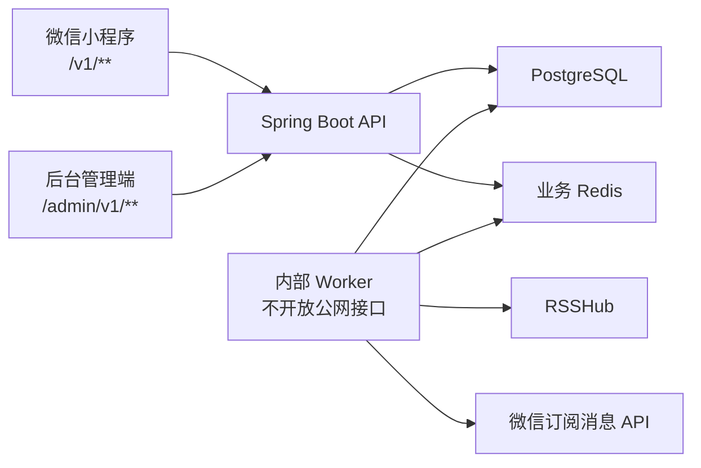

# IdolRadar 系统功能划分与开发状态

更新时间：2026-08-10

状态依据：当前仓库代码、Flyway V1–V6、微信小程序页面和 Worker 实现。

本文用于区分微信小程序、后台管理端、内部 Worker 和公共基础设施的职责，并记录实际开发状态。数据库中已有表或字段，只代表数据基础完成；没有 API、业务逻辑或页面时，不视为功能完成。

## 1. 状态说明

| 状态 | 含义 |
|---|---|
| 已完成 | 已有业务代码并完成当前仓库可执行测试 |
| 部分完成 | 仅完成部分链路，例如只有数据库、只有后端、仍读兼容字段或缺真实环境验证 |
| 未开发 | 尚无对应业务 API、业务逻辑或页面 |
| 待外部验证 | 代码已具备，但依赖微信模板、真机或真实上游数据完成验收 |

## 2. 系统边界

保持一个 Spring Boot 工程和一个部署制品，通过路由前缀、包职责和独立鉴权链隔离。当前规模不拆 Maven 多模块。

## 3. 当前总体状态

| 范围 | 当前状态 |
|---|---|
| 微信小程序基础闭环 | 部分完成；登录、选 idol、首页、动态流、授权记录已实现，真实订阅消息仍待验证 |
| 后台管理端 | 部分完成；真实登录页、独立鉴权、会话吊销和写操作审计已完成，业务页面仍为交互设计数据 |
| 内部 Worker | 主链路已完成；跨源去重、来源屏蔽、多守护读路径尚未接入 |
| PostgreSQL | 已完成 V1–V6；14 张业务表、字段注释、约束和基础索引已生效 |
| Docker 部署 | 已完成 API、Worker、PostgreSQL、Redis、RSSHub 统一编排基础 |

## 4. 微信小程序使用功能

小程序接口统一使用 `/v1/**`。除微信登录接口外，均使用微信用户会话鉴权。

| 功能 | 状态 | 已完成 | 剩余工作 |
|---|---|---|---|
| 微信静默登录 | 已完成 | `wx.login`、`code2Session`、首访建档、会话 token | 真机持续回归 |
| 用户初始化 | 已完成 | `GET /v1/me/bootstrap` 返回用户和守护状态 | 无 |
| 雷达首页 | 已完成 | `GET /v1/home` 返回 idol、统计、动态和订阅额度 | 按后续功能扩展来源开关和用户资料 |
| idol 目录 | 已完成 | `GET /v1/idols`、启用目录、来源数量、本地名称搜索 | 扩充真实 idol 和来源数据 |
| 选择或更换 idol | 已完成 | `PUT /v1/me/idol`；兼容字段与 `idr_user_guard` 双写 | API 读路径改用守护关联表 |
| 动态流 | 已完成 | `GET /v1/feed`、稳定游标分页、下拉刷新、加载更多、复制原文链接 | 接入跨来源去重结果 |
| 今日动态口径 | 已完成 | 按 `Asia/Shanghai` 自然日闭开区间计算，并排除未来时间动态 | 无 |
| 信号强度 | 已完成 | 当前定义为装饰性文案：有启用源显示“满格”，否则“无信号” | 若改成真实健康指标，需重新定义口径 |
| 微信订阅授权记录 | 部分完成 | `wx.requestSubscribeMessage` 后调用 `POST /v1/me/subscriptions`，模板隔离、额度并发控制已实现 | 配置真实模板并完成真机发送验收 |
| 推送落地 | 部分完成 | 消息页面携带 `postId`，雷达页能读取并滚动到最新动态卡片 | 精确定位对应动态；上报投递回访 |
| 微信昵称和头像 | 部分完成 | V6 已有 `nickname`、`avatar_url`、`profile_authorized_at` | 授权交互、资料保存 API、初始化返回和页面展示未开发 |
| 来源列表与开关 | 部分完成 | 已有 `display_name` 和 `idr_user_source_mute` | 查询来源、关闭/开启来源 API 和“我的”页 UI 未开发 |
| 推送回访上报 | 部分完成 | 投递表已有首次打开、最近打开和打开次数字段 | 上报 API、小程序调用和幂等更新未开发 |
| idol 自助申请 | 部分完成 | 申请、支持者、审核结果关联表结构已完成 | 提交、查询本人状态 API 和选 idol 页入口未开发 |
| 多 idol 后端模型 | 部分完成 | `idr_user_guard` 已建表、回填并双写 | 小程序继续限制一位；API 和 Worker 仍需迁移读路径 |

### 4.1 当前已有小程序业务接口

| 方法 | 路径 | 状态 |
|---|---|---|
| POST | `/v1/auth/wechat/login` | 已完成 |
| GET | `/v1/me/bootstrap` | 已完成 |
| GET | `/v1/home` | 已完成 |
| GET | `/v1/feed` | 已完成 |
| GET | `/v1/idols` | 已完成 |
| PUT | `/v1/me/idol` | 已完成 |
| POST | `/v1/me/subscriptions` | 已完成，真实模板待验证 |

### 4.2 小程序待新增接口

接口名称在开发时可微调，但职责不可混入管理端路由。

| 建议方法与路径 | 用途 | 状态 |
|---|---|---|
| PUT `/v1/me/profile` | 保存用户明确授权的昵称和头像 | 未开发 |
| GET `/v1/me/sources` | 查询当前守护 idol 的来源和开关状态 | 未开发 |
| PUT `/v1/me/sources/{sourceId}/mute` | 关闭指定来源推送 | 未开发 |
| DELETE `/v1/me/sources/{sourceId}/mute` | 重新开启指定来源推送 | 未开发 |
| POST `/v1/notification-deliveries/{postId}/open` | 上报从推送进入小程序 | 未开发 |
| POST `/v1/idol-requests` | 提交或支持 idol 申请 | 未开发 |
| GET `/v1/me/idol-requests` | 查询本人申请状态 | 未开发 |

## 5. 后台管理功能

管理端接口统一使用 `/admin/v1/**`。管理员账号、会话与微信用户完全隔离。身份基础已完成，后续业务接口继续沿用同一鉴权与审计链。

### 5.1 管理员身份与访问控制

状态：已完成；真实服务器仍需执行一次 `admin-bootstrap` 创建首个管理员。

- 管理员登录、退出、获取当前管理员
- 管理员会话过期和主动吊销
- 停用管理员后禁止继续登录，并撤销有效会话
- 密码仅保存强哈希
- `/admin/v1/**` 使用独立鉴权链
- 未认证请求不得返回业务数据
- 管理端写操作写入 `idr_admin_audit_log`

已实现接口：

| 方法与路径 | 用途 |
|---|---|
| POST `/admin/v1/auth/login` | 管理员密码登录，返回独立 bearer token |
| GET `/admin/v1/me` | 获取当前管理员 |
| POST `/admin/v1/auth/logout` | 吊销当前管理员会话 |
| POST `/admin/v1/admins/{adminId}/revoke` | 停用管理员并吊销其全部会话 |

已使用数据表：`idr_admin_account`、`idr_admin_session`、`idr_admin_audit_log`。`/admin/` 登录页调用真实接口；登录后的仪表盘和管理业务页仍是交互设计，需随 5.2–5.7 的接口逐步替换。

### 5.2 管理首页仪表盘

状态：未开发，指标字段和时间索引已完成。

- 用户总量和新增用户
- 完成守护人数、完成订阅人数、闭环转化率
- 推送发送量、成功率、失败率、回访率
- 异常抓取源数量
- 待处理 idol 申请数量
- 按时间区间展示趋势

现有数据基础：`idr_user.first_guarded_at`、`first_subscribed_at`、投递打开字段及 V6 时间索引。

### 5.3 idol 管理

状态：未开发；当前只能通过 seed CLI 维护。

- idol 列表、搜索、新增、编辑
- 修改名称、头像、简介
- 启用、停用 idol
- 查看来源数、动态数、守护人数
- 使用 `version` 做乐观锁
- 停用前展示影响范围
- 禁止物理删除历史业务数据

### 5.4 动态源管理

状态：未开发；来源抓取和 seed 导入已完成。

- 按 idol 查询来源
- 新增、编辑、启用、停用来源
- 维护展示名、渠道和 RSS 地址
- 写入前执行 URL 安全校验和可用性测试
- 阻止同一 idol 重复配置同一地址
- 小程序接口不得返回内部 `rss_url`

### 5.5 来源健康度看板

状态：部分完成；Worker 已持续写入健康数据，管理 API 和页面未开发。

- 最近抓取时间、最近成功时间
- 最近状态、错误码
- 解析数量、新增数量
- 连续失败次数
- 按 idol、状态筛选
- 突出连续失败或长时间未成功的来源

第一版只展示每个来源的最新状态，不创建抓取历史表。

### 5.6 手动触发抓取

状态：部分完成；抓取服务和全局并发锁已有，管理入口未开发。

- 对指定来源执行一次抓取
- 返回成功状态、解析数量、新增数量和错误码
- 与定时任务共用下载、解析、入库逻辑
- 与定时抓取并发时不得重复执行
- 接口限流
- 明确是否产生真实推送；默认手动验证不推送
- 操作写审计日志

### 5.7 推送投递看板

状态：部分完成；投递状态机和 outbox 已完成，管理查询和页面未开发。

- 投递状态和失败原因分布
- 待发队列积压量、最久等待时间
- 重试次数和异常投递
- 按时间、idol、状态筛选
- 查看是否从推送回访
- 禁止展示用户 OpenID

### 5.8 idol 申请审核

状态：未开发，数据库基础已完成。

- 按状态和支持人数查看申请队列
- 查看用户补充说明
- 通过或驳回申请
- 填写审核备注
- 通过时创建或关联正式 idol
- 进入已有 idol 和来源配置流程
- 用户能在小程序查看最终状态

### 5.9 管理审计日志

状态：未开发，审计表已完成。

- 查询操作者、操作类型、资源和时间
- 查询操作成功或失败结果
- 通过 request ID 关联应用日志
- 保存修改前后业务摘要
- 禁止记录密码、token、OpenID 和服务密钥

### 5.10 后台管理页面清单

管理 UI 开发前先完成页面效果图，至少包含：

1. 管理员登录页
2. 核心指标首页
3. idol 列表与编辑页
4. 来源管理与健康度页；手动抓取作为来源行操作，不单独建页面
5. 推送投递看板
6. idol 申请审核队列
7. 审计日志页

## 6. 内部 Worker 功能

Worker 不开放公网接口。管理端手动抓取应调用同一业务服务，不复制第二套抓取代码。

| 功能 | 状态 | 说明 |
|---|---|---|
| 固定周期调度 | 已完成 | 默认每 30 分钟，固定延迟避免慢任务堆叠 |
| 多实例防重入 | 已完成 | PostgreSQL advisory lock |
| 读取启用来源 | 已完成 | 同时过滤停用 idol 和停用来源 |
| 多来源并发抓取 | 已完成 | 有上限的虚拟线程池；单源失败不阻塞其他源 |
| 请求目标安全防护 | 已完成 | 地址、重定向、响应大小、XML 安全校验 |
| RSS 解析和缺字段降级 | 已完成 | 缺摘要、发布时间等情况有降级策略 |
| 原文链接去重 | 已完成 | 数据库唯一约束和幂等插入 |
| 跨来源内容去重 | 部分完成 | 已有 `dedup_key` 和唯一索引，Worker 尚未计算和写入 |
| 动态与 outbox 同事务 | 已完成 | 避免动态入库后丢失推送意图 |
| 来源健康状态更新 | 已完成 | 最近状态、错误码、数量、最近成功、连续失败 |
| 推送目标筛选 | 部分完成 | 仍读取 `idr_user.idol_id`，尚未使用 `idr_user_guard` 和来源屏蔽表 |
| 微信投递状态机 | 已完成 | 预留、发送、重试、成功、失败、不确定状态 |
| 额度原子扣减与补偿 | 已完成 | 避免并发超发和失败吞额度 |
| delivery 重试与对账 | 已完成 | 到期重试、遗留状态恢复、未知结果不重发 |
| outbox lease 恢复 | 已完成 | Worker 中断后可恢复任务 |
| 真实微信投递 | 待外部验证 | 需要正式模板 ID、真实用户授权和真机验收 |
| 手动单源抓取 | 未开发 | 复用现有抓取组件，不新增第二套 Worker |

## 7. 公共基础设施

| 功能 | 状态 | 说明 |
|---|---|---|
| Flyway V1–V6 | 已完成 | 统一 `idr_` 表前缀、约束、索引和中文注释 |
| PostgreSQL 数据持久化 | 已完成 | 当前本地数据库已迁移到 V6 |
| Redis | 已完成 | 分布式限流、微信 access token 缓存和健康检查 |
| 小程序接口限流 | 已完成 | 登录、默认接口和订阅操作使用不同限制 |
| 健康检查 | 已完成 | `/healthz`、`/readyz` |
| Docker Compose | 已完成 | API、Worker、PostgreSQL、Redis、RSSHub 统一编排 |
| 发布校验 | 已完成 | 必需文件、迁移、seed 和敏感配置检查 |
| 管理端独立鉴权 | 已完成 | PBKDF2 密码、独立 token、统一路由保护、会话吊销与写操作审计 |
| 运行监控与主动告警 | 未开发 | 当前只有健康检查和结构化日志 |

## 8. 数据库结构与功能归属

| 表 | 主要写入方 | 主要读取方 | 当前状态 |
|---|---|---|---|
| `idr_idol` | seed、未来管理端 | 小程序、管理端、Worker | 已使用 |
| `idr_source` | seed、Worker、未来管理端 | 小程序、管理端、Worker | 已使用；小程序来源接口未开发 |
| `idr_post` | Worker | 小程序、管理端、Worker | 已使用；跨源去重未接入 |
| `idr_user` | 登录和小程序 API | 小程序、Worker、未来管理端统计 | 已使用；资料字段未接入 |
| `idr_user_session` | 登录服务 | 小程序鉴权 | 已使用 |
| `idr_user_guard` | 小程序 API | 未来小程序 API、Worker | 已双写；读迁移未完成 |
| `idr_user_source_mute` | 未来小程序 API | 未来小程序 API、Worker | 仅结构完成 |
| `idr_notification_outbox` | Worker | Worker、未来管理端 | 已使用 |
| `idr_notification_delivery` | Worker、未来回访 API | Worker、未来管理端 | 已使用；回访字段未接入 |
| `idr_admin_account` | `admin-bootstrap`、管理端吊销接口 | 管理端鉴权 | 已使用 |
| `idr_admin_session` | 管理端鉴权 | 管理端鉴权 | 已使用 |
| `idr_admin_audit_log` | 管理端统一审计拦截器 | 未来审计页面 | 已写入；查询页面未开发 |
| `idr_idol_request` | 未来小程序和管理端 | 未来小程序和管理端 | 仅结构完成 |
| `idr_idol_request_supporter` | 未来小程序 | 未来小程序和管理端 | 仅结构完成 |

## 9. 推荐开发顺序

1. 管理员登录、独立鉴权和审计基础。
2. idol/来源管理、来源健康度、手动抓取。
3. Worker 跨源去重、守护关联读迁移、来源屏蔽过滤。
4. 小程序用户资料、来源开关、推送回访。
5. 推送投递看板和核心指标看板。
6. idol 自助申请、管理审核和小程序状态查询。
7. API 与 Worker 全部改读 `idr_user_guard` 后，最后删除 `idr_user.idol_id` 和 `guarding_since`。

## 10. 当前不开发

- 普通用户列表和用户隐私详情
- 管理端查看用户 OpenID
- 手工修改用户订阅额度
- 收费、订单、支付
- 多角色权限系统
- 在线修改微信 AppSecret、数据库密码、Redis 密码
- RSSHub Cookie 在线管理
- 动态内容人工编辑
- 物理删除 idol、用户或历史动态

微信 AppSecret、数据库密码、Redis 密码和 RSSHub Cookie 继续由服务器 `.env` 管理，不进入数据库、管理页面和 Git。
